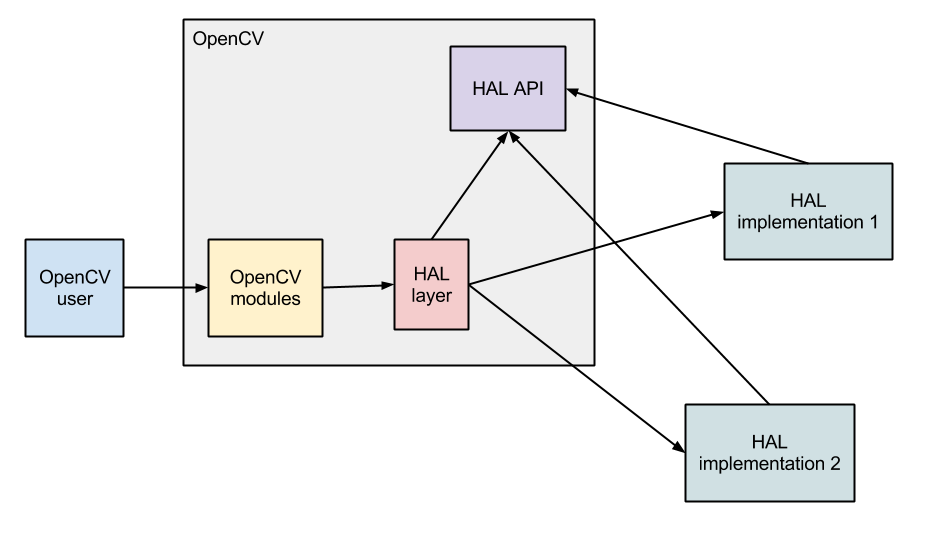

OpenCV Hardware Acceleration Layer
==================================

This document describes design for the OpenCV Hardware Acceleration Layer (HAL) interface.

HAL is a separate module that contains optimized implementation of some basic functions. 
It is used to accelerate OpenCV for different platforms.
The HAL implementations can be provided by different third-party developers.

The main goal is that the HAL can be developed independently from OpenCV.
It can have own release process, it can be closed-source.
OpenCV can provide separate test suite for HAL implementations.

OpenCV can be built in three different modes:
* Without HAL support. Only default implementation will be used in this mode.
* With statically-linked HAL. OpenCV will use accelerated function from this HAL.
* With dynamically-loadable HAL support. OpenCV will try to load HAL implementation at runtime, if it fails OpenCV will use default implementation.


HAL design
----------

The proposed HAL design consists of several parts:




HAL API
-------

OpenCV provides HAL interface description (as a set of C header files).
This headers will be used both in OpenCV and in HAL implementations.

HAL API is a set of functions prototypes.
All funcions has plain C interface (no classes, no stl, no exceptions, etc.).

```C
// This two functions must be implemented in all HALs.

CV_HAL_API CvHalStatus cvhal_init(CvHalContext context); // initialize HAL
CV_HAL_API const char* cvhal_info(); // Get information about HAL (name, vendor, version, etc.)

// This is the set of HAL functions.

CV_HAL_API CvHalStatus cvhal_hamming_dist(unsigned char* a, unsigned char* b, size_t len, int* result, CvHalContext context);

CV_HAL_API CvHalStatus cvhal_resize(CvHalMat* src, CvHalMat* dst, int interpolation, CvHalContext context);

CV_HAL_API CvHalStatus cvhal_erode(CvHalMat* src, CvHalMat* dst, unsigned char* kernel, CvHalSize kernelSize, CvHalPoint anchor, CvHalContext context);
```

This interface can only be extended in new OpenCV versions, we can add new functions, but we can't change existed prototypes.

A HAL doesn't have to implement all operations. It can implement only a subset of this interface.
Also HAL doesn't have to support all input parameters (for example, interpolation mode in resize).
Each function can return `CV_HAL_NOT_IMPLEMENTED` error code for unsupported parameters.
In this case OpenCV will use default implementation.

The HAL API doesn't depend on OpenCV API. It has own types, macroses and constants definitions.

In addition to input parameters all HAL functions accept `CvHalContext` struct, which contains some additional information like:
* OpenCV version
* Some parameters (number of threads)
* Information about CUDA device
* CUDA stream id

HAL API provides set of macroses for reading this parameters.
We can add new entries to context in new OpenCV versions, so this macroses checks current OpenCV version and returns default values for old releases.

```C
#define CV_HAL_GET_OPENCV_VERSION(context) \
    ((context) ? (int) *(int*)((context) + CV_HAL_CONTEXT_IND_OPENCV_VERSION) : 0)

// OpenCV 3.0

#define CV_HAL_GET_NUM_THREADS(context) \
    (CV_HAL_GET_OPENCV_VERSION(context) >= 300 ? *(int*)((context) + CV_HAL_CONTEXT_IND_NUM_THREADS) : -1)

// OpenCV 3.1

#define CV_HAL_GET_CUDA_STREAM(context) \
    (CV_HAL_GET_OPENCV_VERSION(context) >= 310 ? (cudaStream_t) (context)[CV_HAL_CONTEXT_IND_CUDA_STREAM] : (cudaStream_t) 0)
```


HAL design
----------

* OpenCV can be built in three modes:
  * Without HAL support.
  * With statically-linked HAL.
  * With dynamically-loadable HAL support.

* If OpenCV was built with statically-linked HAL, it will use it.

* If OpenCV was built with dynamically-loadable HAL support,
  the library will try to load HAL at runtime.

* If OpenCV was built without HAL support, it won't use any HAL and
  won't try to load HAL at runtime.

* OpenCV provides HAL interface description (as a set of C header files).
* HAL interface has plain C API. This API is fixed.
  It can be only extended with new functions.
* A HAL implementation doesn't have to implement all operations.
  A HAL developer can implement only subset of this interface.
* Some small functions from HAL are available only in static mode as inlined (cvRound, for example).
* OpenCV can provide separate test suite set for HAL implementations.

* In dynamically-loadable mode the initialization can be explicit or implicit.
  OpenCV user can load own HAL from code (cv::loadHalImpl("myhal.so")).
  Otherwize, HAL will be initilized on the first call.


Implementation details
----------------------

OpenCV has a special header `hal_interface.h`, which defines HAL interface.
This header is used both in OpenCV and in HAL implementations.
This header can be extended in new OpenCV versions, we can add new functions,
but we can't change existed prototypes.

HAL developer can implement a subset of functions defined in this header.

HAL developer provides own header for the HAL - `hal_impl.h`. This header is used for static build.
Thу header defines macros, describing which functions are provided by the HAL (like `CV_HAL_HAS_RESIZE`).
Also this header can contain some inline funcions (like cvRound).
OpenCV provides a template for this header - `hal_impl_templ.h`

OpenCV has CMake variable `OPENCV_STATIC_HAL`.
If this variable points to some static HAL OpenCV will use this HAL,
otherwize OpenCV will use dynamically-loadable mode,
if `OPENCV_DYNAMIC_HAL` is `TRUE`.

OpenCV has C++ wrappers for HAL API (`hal.hpp` and `hal.cpp`),
that converts OpenCV structures (Mat, vectors, etc.) to HAL types.
All functions return boolean value, which indicates if HAL call was successfull or not.
If HAL fails OpenCV uses own implementation.
This wrappers are generated automatically from `hal_interface.h` by scripts.
